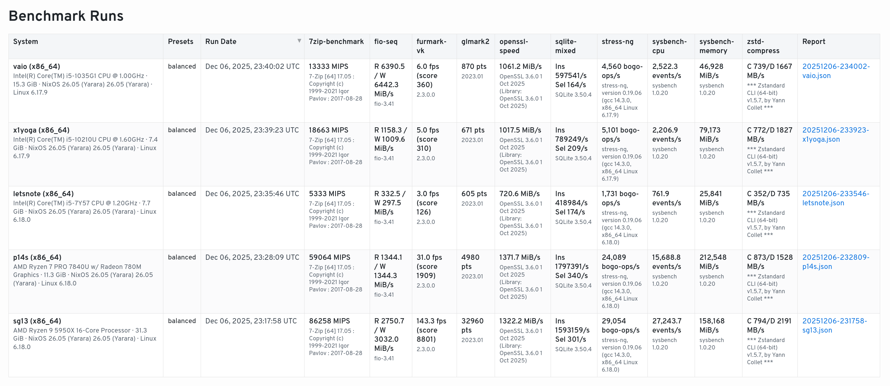
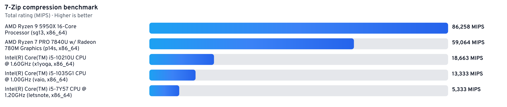

# nixos-benchmark

Easily run benchmarks on Nix/NixOS in a quick and reproducible way (CPU, memory, IO, GPU, network, etc.).

## Quick use
```bash
# list presets / benchmarks directly from the flake
nix run github:dbeley/nixos-benchmark -- --list-presets
nix run github:dbeley/nixos-benchmark -- --list-benchmarks

# run the default preset
nix run github:dbeley/nixos-benchmark --

# target presets or specific benches
# comma-separated syntax or repeated arguments work for both presets and benchmarks options
nix run github:dbeley/nixos-benchmark -- --presets cpu --presets io
nix run github:dbeley/nixos-benchmark -- --benchmarks openssl-speed,fio-seq
```

## Requirements
- Nix with flakes enabled
- Optional: direnv for automatic shell loading
- Unfree GPU tools: set `NIXPKGS_ALLOW_UNFREE=1` when running (needed for FurMark)


## Benchmarks

Available presets: `balanced` (default), `cpu`, `io`, `memory`, `compression`, `crypto`, `database`, `gpu-light`, `gpu`, `network`, `all`. Use `--presets all` if you want every benchmark.

- CPU: openssl speed, 7-Zip, John, Stockfish, stress-ng, sysbench cpu, geekbench
- Memory: sysbench memory, stressapptest, tinymembench
- IO / storage: fio seq, ioping, iozone, bonnie++, sqlite mixed, sqlite speedtest, cryptsetup
- Compression: zstd, pigz, lz4, x264, x265, ffmpeg transcode
- GPU: glmark2, furmark-gl, furmark-vk, furmark-knot-gl, furmark-knot-vk, clpeak, hashcat, geekbench gpu (default + vulkan)
- Network: netperf, wrk (local HTTP)

Use `--list-benchmarks` to see the exact preset coverage for each entry.

## Reports
- JSON per run in `results/` (git-ignored): system info (CPU, GPU, RAM, OS/kernel), requested presets/benchmarks, per-benchmark metrics, command, duration, tool version, and raw output.
- HTML dashboard (`--html-summary path` to override the output filename) reads all JSON files in `results/` and shows run summaries. Each row carries its own system details and benchmark versions; hover a system name for a tooltip if you need the full breakdown.
- Refresh the HTML dashboard without running benchmarks: `python -m nixos_benchmark --html-only` (or `nix run . -- --html-only`) reads existing JSON results and writes to the `--html-summary` path.

## Notes
- glmark2 defaults to offscreen; pass `--glmark2-mode onscreen` if you want visible rendering.
- Geekbench requires internet access to publish results; follow the printed link if scores are missing from stdout.

## Sample Output



